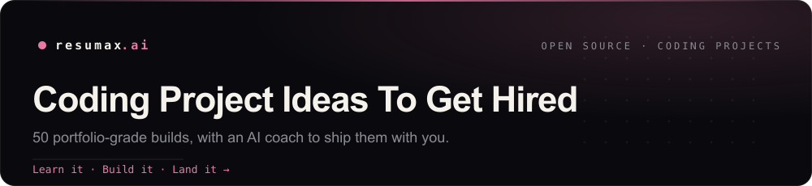

  

# Coding Project Ideas To Get Hired

50 real, portfolio-grade projects across 9 domains, each with the exact skills it proves, the references to start, and an AI coach to build it with you. A shipped project beats a claimed skill.

  

> **The loop:** [learn the roadmap](https://github.com/resumax/software-engineer-roadmaps) &rarr; **build a project to prove the skill** &rarr; [apply to open roles](https://github.com/resumax/new-grad-tech-jobs) &rarr; tailor your resume with the [Atlas coach](https://resumax.ai/?utm_source=github&utm_medium=repo&utm_campaign=coding-project-ideas&utm_content=intro). This repo is the build step.

## Browse

**By domain:** [AI & Agents](#ai-and-agents) (15) &nbsp;·&nbsp; [Backend & APIs](#backend-and-apis) (3) &nbsp;·&nbsp; [Data & ML](#data-and-ml) (10) &nbsp;·&nbsp; [Games](#games) (3) &nbsp;·&nbsp; [Mobile](#mobile) (2) &nbsp;·&nbsp; [Security](#security) (3) &nbsp;·&nbsp; [Systems & CLI](#systems-and-cli) (5) &nbsp;·&nbsp; [Web](#web) (7) &nbsp;·&nbsp; [DevOps & Cloud](#devops-and-cloud) (2)

**By level:** Beginner &nbsp;·&nbsp; Intermediate &nbsp;·&nbsp; Advanced &nbsp;·&nbsp; Pro &nbsp; (every project is tagged)

## AI & Agents

| Project | Level | What you build | Start here | |
|---|---|---|---|---|
| **[Recall: AI Flashcard Generator](https://resumax.ai/projects/ai-flashcard-generator?utm_source=github&utm_medium=repo&utm_campaign=coding-project-ideas&utm_content=ai-flashcard-generator)** | `Beginner` | Paste study text and generate clean question-and-answer flashcards you can review with spaced repetition, all stored locally. | [AI Flashcard Next.js (Basic) — DEV Comm…](https://dev.to/tak089/ai-flashcard-nextjs-basic-4kfh) · [Structured Outputs with Vercel's AI SDK…](https://www.aihero.dev/structured-outputs-with-vercel-ai-sdk) |  |
| **[Ask-a-Podcast RAG Search](https://resumax.ai/projects/rag-search-over-podcast-archive?utm_source=github&utm_medium=repo&utm_campaign=coding-project-ideas&utm_content=rag-search-over-podcast-archive)** | `Intermediate` | Transcribe a podcast back-catalog, chunk and embed it, then answer questions with cited timestamps that deep-link into episodes. | [Building a YouTube Video Search App wit…](https://dev.to/abhirajadhikary06/building-a-youtube-video-search-app-with-flask-whisper-and-rag-ebl) · [Production RAG with a Postgres Vector S…](https://christophergs.com/blog/production-rag-with-postgres-vector-store-open-source-models) |  |
| **[Chatbot That Remembers You](https://resumax.ai/projects/chatbot-with-long-term-memory?utm_source=github&utm_medium=repo&utm_campaign=coding-project-ideas&utm_content=chatbot-with-long-term-memory)** | `Intermediate` | Build a chat assistant that persists facts about each user across sessions and recalls them in later conversations. | [Vercel AI SDK — RAG Chatbot Guide (Next…](https://ai-sdk.dev/cookbook/guides/rag-chatbot) · [From Ephemeral to Persistence with Lang…](https://towardsdatascience.com/from-ephemeral-to-persistence-with-langchain-building-long-term-memory-in-chatbots-57637afedbe6/) |  |
| **[LLM Trip Planner With Live Tools](https://resumax.ai/projects/llm-trip-planner-tool-calling?utm_source=github&utm_medium=repo&utm_campaign=coding-project-ideas&utm_content=llm-trip-planner-tool-calling)** | `Intermediate` | Build an agent that plans a trip by calling real flight, weather, and maps APIs through function calling and streaming the itinerary. | [Build Your First AI Agent in TypeScript…](https://dev.to/pmbanugo/build-your-first-ai-agent-in-typescript-hbo) · [Build an AI Chat Agent with Weather API…](https://vercel.com/kb/guide/build-ai-agent-weather-api) |  |
| **[Local LLM Workstation](https://resumax.ai/projects/local-llm-workstation?utm_source=github&utm_medium=repo&utm_campaign=coding-project-ideas&utm_content=local-llm-workstation)** | `Intermediate` | Run open models like Llama 3 and Qwen fully offline, with a clean chat UI. | [Ultimate Local AI Setup Guide: Ubuntu,…](https://www.robwillis.info/2025/05/ultimate-local-ai-setup-guide-ubuntu-ollama-open-webui/) · [How to Use Ollama with Open WebUI via D…](https://geshan.com.np/blog/2025/02/ollama-docker-compose/) |  |
| **[Agentic RAG Knowledge Platform](https://resumax.ai/projects/agentic-rag-knowledge-platform?utm_source=github&utm_medium=repo&utm_campaign=coding-project-ideas&utm_content=agentic-rag-knowledge-platform)** | `Advanced` | Build a hybrid-search RAG service that routes queries across retrieval, web fallback, and a reranker, with citations and an offline eval harness that scores faithfulness. | [Agentic RAG with LangGraph — Qdrant Off…](https://qdrant.tech/documentation/tutorials-build-essentials/agentic-rag-langgraph/) · [Building Agentic RAG Systems with LangG…](https://www.analyticsvidhya.com/blog/2024/07/building-agentic-rag-systems-with-langgraph/) |  |
| **[Autonomous Coding Agent](https://resumax.ai/projects/autonomous-coding-agent?utm_source=github&utm_medium=repo&utm_campaign=coding-project-ideas&utm_content=autonomous-coding-agent)** | `Advanced` | Build an agent that reads a GitHub issue, plans, edits files in a sandbox, runs tests, self-corrects on failures, and opens a pull request, then score it on real SWE-bench tasks. | [SWE-agent Deep Dive & Build-Your-Own Gu…](https://dev.to/truongpx396/swe-agent-deep-dive-build-your-own-guide-ade) · [Build a coding agent with Modal Sandbox…](https://modal.com/docs/examples/agent) |  |
| **[Build Your Own LLM From Scratch](https://resumax.ai/projects/nano-llm-from-scratch?utm_source=github&utm_medium=repo&utm_campaign=coding-project-ideas&utm_content=nano-llm-from-scratch)** | `Advanced` | Train a small GPT-style model end to end: write the tokenizer, the transformer, pretraining, supervised fine-tuning, and a chat inference server you can talk to. | [LLMs-from-scratch: Implement a ChatGPT-…](https://github.com/rasbt/LLMs-from-scratch) · [Let's build GPT: from scratch, in code,…](https://www.youtube.com/watch?v=kCc8FmEb1nY) |  |
| **[Multimodal Semantic Search Engine](https://resumax.ai/projects/multimodal-search-engine?utm_source=github&utm_medium=repo&utm_campaign=coding-project-ideas&utm_content=multimodal-search-engine)** | `Advanced` | Index images and text into one embedding space with CLIP, build a low-latency vector index with metadata filtering, and serve cross-modal search where text queries find images. | [Build Image Search with CLIP, Qdrant, a…](https://cocoindex.io/blogs/live-image-search/) · [Neural Search 101: Build a Neural Searc…](https://qdrant.tech/articles/neural-search-tutorial/) |  |
| **[RAG Over Your Notes](https://resumax.ai/projects/rag-over-your-notes?utm_source=github&utm_medium=repo&utm_campaign=coding-project-ideas&utm_content=rag-over-your-notes)** | `Advanced` | A chatbot that answers from your own PDFs, notes, and Obsidian vault, with sources. | [How to Build a RAG Solution with LlamaI…](https://dev.to/sophyia/how-to-build-a-rag-solution-with-llama-index-chromadb-and-ollama-20lb) · [LlamaIndex: Building a Smarter RAG-Base…](https://pyimagesearch.com/2024/09/02/llamaindex-building-a-smarter-rag-based-chatbot/) |  |
| **[Real-Time Voice Agent With MCP Tools](https://resumax.ai/projects/voice-agent-with-mcp-tools?utm_source=github&utm_medium=repo&utm_campaign=coding-project-ideas&utm_content=voice-agent-with-mcp-tools)** | `Advanced` | Build a sub-second speech-to-speech agent that calls live tools through a Model Context Protocol server you write, with barge-in, streaming audio, and turn-taking handled cleanly. | [MCP-Powered Agentic Voice Framework — O…](https://developers.openai.com/cookbook/examples/partners/mcp_powered_voice_agents/mcp_powered_agents_cookbook) · [How to Build an MCP Voice Agent with Op…](https://www.assemblyai.com/blog/mcp-voice-agent-openai-livekit) |  |
| **[Agent Evaluation & Observability Harness](https://resumax.ai/projects/agent-eval-harness?utm_source=github&utm_medium=repo&utm_campaign=coding-project-ideas&utm_content=agent-eval-harness)** | `Pro` | A test rig that replays agent trajectories against graded task suites, scores them with an LLM judge, and tracks regressions across model and prompt versions | [How to Evaluate AI Agents: LLM-as-Judge…](https://dev.to/aws/how-to-evaluate-ai-agents-llm-as-judge-tutorial-4a6h) · [How to Build an LLM Evaluation Framewor…](https://www.confident-ai.com/blog/how-to-build-an-llm-evaluation-framework-from-scratch) |  |
| **[Build Your Own AI Coding Agent](https://resumax.ai/projects/code-agent-from-scratch?utm_source=github&utm_medium=repo&utm_campaign=coding-project-ideas&utm_content=code-agent-from-scratch)** | `Pro` | A terminal coding agent that reads your repo, plans edits, runs tools in a loop, and opens PRs with a real agent harness and permission gates | [How to Build a Coding Agent: Free Works…](https://ghuntley.com/agent/) · [Tutorial: Build a Tool-Using Agent (5 C…](https://platform.claude.com/docs/en/agents-and-tools/tool-use/build-a-tool-using-agent) |  |
| **[Multi-Agent Research Swarm](https://resumax.ai/projects/multi-agent-research-swarm?utm_source=github&utm_medium=repo&utm_campaign=coding-project-ideas&utm_content=multi-agent-research-swarm)** | `Pro` | An orchestrator-worker system where a lead agent spawns parallel sub-agents that fan out web searches, critique each other, and merge a cited report | [How to Build a Multi-Agent AI System wi…](https://www.freecodecamp.org/news/how-to-build-a-multi-agent-ai-system-with-langgraph-mcp-and-a2a-full-book/) · [LangGraph Tutorial: Build A Multi-Agent…](https://www.youtube.com/watch?v=PesF6IHtul8) |  |
| **[Personal Agent That Lives in Your Chats](https://resumax.ai/projects/personal-agent-in-your-chats?utm_source=github&utm_medium=repo&utm_campaign=coding-project-ideas&utm_content=personal-agent-in-your-chats)** | `Pro` | A Telegram and iMessage agent with long-term memory and a cron scheduler that proactively runs jobs, remembers context, and acts across your tools | [How to Build and Secure a Personal AI A…](https://www.freecodecamp.org/news/how-to-build-and-secure-a-personal-ai-agent-with-openclaw/) · [Build a Personalized AI Assistant with…](https://supabase.com/blog/natural-db) |  |

Each title opens the full build on ResuMax (overview, step-by-step start, and the architecture). The pink button opens the Atlas coach, which scopes the project to your level and unblocks step one.

## Backend & APIs

| Project | Level | What you build | Start here | |
|---|---|---|---|---|
| **[Shrtn: URL Shortener API](https://resumax.ai/projects/url-shortener-rest-api?utm_source=github&utm_medium=repo&utm_campaign=coding-project-ideas&utm_content=url-shortener-rest-api)** | `Beginner` | Build a REST API that turns long links into short codes, redirects on lookup, and counts clicks, with rate limiting and tests. | [How to Make a URL Shortener from Scratc…](https://dev.to/tzgyn/how-to-make-a-url-shortener-from-scratch-ec5) · [How To Build a Type-Safe URL Shortener…](https://www.digitalocean.com/community/tutorials/how-to-build-a-type-safe-url-shortener-in-nodejs-with-nestjs) |  |
| **[URL Shortener With Click Analytics](https://resumax.ai/projects/url-shortener-with-analytics?utm_source=github&utm_medium=repo&utm_campaign=coding-project-ideas&utm_content=url-shortener-with-analytics)** | `Intermediate` | Build a link shortener that survives traffic spikes, with cached redirects, custom slugs, and a live per-link click dashboard. | [How to Build a Scalable URL Shortener w…](https://www.freecodecamp.org/news/how-to-build-a-scalable-url-shortener-with-distributed-caching-using-redis/) · [Build a URL Shortener with Go, Redis, a…](https://getstream.io/blog/url-shortener/) |  |
| **[Relational Database With a Query Planner](https://resumax.ai/projects/relational-database-engine?utm_source=github&utm_medium=repo&utm_campaign=coding-project-ideas&utm_content=relational-database-engine)** | `Pro` | A SQL database engine with a B+tree storage layer, a write-ahead log, MVCC transactions, and a cost-based optimizer that plans real queries | [Build Your Own Database From Scratch in…](https://build-your-own.org/database/) · [ToyDB — Distributed SQL Database in Rus…](https://github.com/erikgrinaker/toydb) |  |

Each title opens the full build on ResuMax (overview, step-by-step start, and the architecture). The pink button opens the Atlas coach, which scopes the project to your level and unblocks step one.

## Data & ML

| Project | Level | What you build | Start here | |
|---|---|---|---|---|
| **[DataLab: Clean and Chart a Real Dataset](https://resumax.ai/projects/dataset-cleanup-visualization?utm_source=github&utm_medium=repo&utm_campaign=coding-project-ideas&utm_content=dataset-cleanup-visualization)** | `Beginner` | Take a messy public CSV, clean and reshape it, then produce labeled charts and a short findings write-up in a notebook. | [Data Analysis with Python – Full Course…](https://www.youtube.com/watch?v=r-uOLxNrNk8) · [Exploratory Data Analysis with Numpy, P…](https://www.freecodecamp.org/news/exploratory-data-analysis-with-numpy-pandas-matplotlib-seaborn/) |  |
| **[Custom Image Classifier, Shipped](https://resumax.ai/projects/fine-tune-image-classifier-deploy?utm_source=github&utm_medium=repo&utm_campaign=coding-project-ideas&utm_content=fine-tune-image-classifier-deploy)** | `Intermediate` | Fine-tune a vision model on your own labeled photos and serve real-time predictions from a web app with confidence scores. | [Fine-Tuning Image Classifiers with PyTo…](https://christianjmills.com/posts/pytorch-train-image-classifier-timm-hf-tutorial/) · [Exporting timm Image Classifiers from P…](https://christianjmills.com/posts/pytorch-train-image-classifier-timm-hf-tutorial/onnx-export/) |  |
| **[Streaming Event Analytics Pipeline](https://resumax.ai/projects/streaming-event-analytics-pipeline?utm_source=github&utm_medium=repo&utm_campaign=coding-project-ideas&utm_content=streaming-event-analytics-pipeline)** | `Intermediate` | Ingest a firehose of clickstream events, aggregate them in real time, and serve sub-second metrics to a live dashboard. | [Kafka + ClickHouse Real-Time Data Pipel…](https://dev.to/mohhddhassan/kafka-clickhouse-real-time-data-pipeline-for-beginners-m1p) · [How to Build a Real-Time OLAP Database…](https://www.redpanda.com/blog/real-time-olap-database-clickhouse-redpanda) |  |
| **[Fine-Tune and Serve a Domain LLM](https://resumax.ai/projects/domain-llm-fine-tune-and-eval?utm_source=github&utm_medium=repo&utm_campaign=coding-project-ideas&utm_content=domain-llm-fine-tune-and-eval)** | `Advanced` | Curate a domain dataset, fine-tune an open model with QLoRA, quantize it, serve it behind a fast inference endpoint, and prove the lift with an LLM-judge eval suite. | [How to Fine-Tune Open LLMs in 2025 with…](https://www.philschmid.de/fine-tune-llms-in-2025) · [Fine-Tune and Deploy Open-Source LLMs f…](https://www.decodingai.com/p/playbook-to-fine-tune-and-deploy) |  |
| **[Real-Time Fraud Detection Pipeline](https://resumax.ai/projects/realtime-fraud-detection-pipeline?utm_source=github&utm_medium=repo&utm_campaign=coding-project-ideas&utm_content=realtime-fraud-detection-pipeline)** | `Advanced` | Stream transactions through Kafka and Flink, compute online features in a feature store, score them with a model in under a second, and watch precision and recall drift on a live dashboard. | [Fraud Detection with the DataStream API…](https://nightlies.apache.org/flink/flink-docs-release-1.20/docs/try-flink/datastream/) · [Building a Streaming Fraud Detection Sy…](https://florimond.dev/en/posts/2018/09/building-a-streaming-fraud-detection-system-with-kafka-and-python) |  |
| **[Two-Tower Recommender Engine](https://resumax.ai/projects/two-tower-recommender-engine?utm_source=github&utm_medium=repo&utm_campaign=coding-project-ideas&utm_content=two-tower-recommender-engine)** | `Advanced` | Build a production recommender with two-tower retrieval and a ranking model, serve nearest-neighbor candidates from an ANN index, and run an offline-to-online A/B eval loop. | [Grokking Two-Tower Models (PyTorch + Go…](https://medium.com/@cole.ian.diamond/grokking-two-tower-models-53e0140897e2) · [Building a Two-Tower Recommendation Sys…](https://redis.io/tutorials/building-a-two-tower-recommendation-system-with-redis-vl/) |  |
| **[Vectorized Columnar Query Engine](https://resumax.ai/projects/columnar-query-engine?utm_source=github&utm_medium=repo&utm_campaign=coding-project-ideas&utm_content=columnar-query-engine)** | `Advanced` | Build a small analytical query engine that parses SQL, plans and optimizes it, and executes vectorized scans and joins over columnar Parquet files with predicate pushdown. | [How Query Engines Work (Andy Grove) — f…](https://howqueryengineswork.com/00-introduction.html) · [A SQL Query Compiler from Scratch in Ru…](https://andres.senac.es/posts/query-compiler-part-one/) |  |
| **[LLM Inference Server From Scratch](https://resumax.ai/projects/llm-inference-server-from-scratch?utm_source=github&utm_medium=repo&utm_campaign=coding-project-ideas&utm_content=llm-inference-server-from-scratch)** | `Pro` | A GPU inference server that loads open weights and serves them with a KV cache, paged attention, and continuous batching behind an OpenAI-compatible API | [Fast LLM Inference From Scratch (yalm)…](https://andrewkchan.dev/posts/yalm.html) · [tiny-vllm: Build Your Own LLM Inference…](https://github.com/jmaczan/tiny-vllm) |  |
| **[Text-to-Image Diffusion Model From Scratch](https://resumax.ai/projects/diffusion-image-model-from-scratch?utm_source=github&utm_medium=repo&utm_campaign=coding-project-ideas&utm_content=diffusion-image-model-from-scratch)** | `Pro` | Implement a latent diffusion model with a U-Net denoiser and CLIP conditioning, train it on an image set, and sample new images from a text prompt | [Coding Stable Diffusion from Scratch in…](https://www.youtube.com/watch?v=ZBKpAp_6TGI) · [Diffusion Model from Scratch in PyTorch…](https://towardsdatascience.com/diffusion-model-from-scratch-in-pytorch-ddpm-9d9760528946/) |  |
| **[Train a Small Language Model From Scratch](https://resumax.ai/projects/small-language-model-pretrained?utm_source=github&utm_medium=repo&utm_campaign=coding-project-ideas&utm_content=small-language-model-pretrained)** | `Pro` | Pretrain a ~100M-parameter transformer on your own tokenized corpus, then instruction-tune and align it with DPO until it follows chat prompts | [Let's build GPT: from scratch, in code,…](https://www.youtube.com/watch?v=kCc8FmEb1nY) · [Let's reproduce GPT-2 (124M) — Andrej K…](https://www.youtube.com/watch?v=l8pRSuU81PU) |  |

Each title opens the full build on ResuMax (overview, step-by-step start, and the architecture). The pink button opens the Atlas coach, which scopes the project to your level and unblocks step one.

## Games

| Project | Level | What you build | Start here | |
|---|---|---|---|---|
| **[Starshard: A 2D Arcade Game](https://resumax.ai/projects/godot-2d-arcade-game?utm_source=github&utm_medium=repo&utm_campaign=coding-project-ideas&utm_content=godot-2d-arcade-game)** | `Beginner` | Build a playable space shooter with sprites, collisions, enemy waves, score, sound, and a game-over screen. | [Space Shooter Tutorial — electronstudio…](https://electronstudio.github.io/godot_space/tutorial.html) · [Your First 2D Game — KidsCanCode Godot…](https://kidscancode.org/godot_recipes/4.x/games/first_2d/index.html) |  |
| **[Authoritative Multiplayer Game Server](https://resumax.ai/projects/authoritative-multiplayer-game-server?utm_source=github&utm_medium=repo&utm_campaign=coding-project-ideas&utm_content=authoritative-multiplayer-game-server)** | `Intermediate` | Build a top-down .io game with a server-authoritative loop, client prediction, and reconciliation so cheating and lag both lose. | [Fast-Paced Multiplayer (Parts I–IV) — G…](https://www.gabrielgambetta.com/client-server-game-architecture.html) · [Colyseus + Phaser: Real-Time Multiplaye…](https://docs.colyseus.io/learn/tutorial/phaser) |  |
| **[Physically-Based Ray Tracer](https://resumax.ai/projects/graphics-ray-tracer?utm_source=github&utm_medium=repo&utm_campaign=coding-project-ideas&utm_content=graphics-ray-tracer)** | `Pro` | A from-scratch path tracer that renders photoreal scenes with global illumination, materials, and a BVH acceleration structure on multiple threads | [Ray Tracing in One Weekend (Free Book S…](https://raytracing.github.io/books/RayTracingInOneWeekend.html) · [Ray Tracing: The Next Week — BVH, Textu…](https://raytracing.github.io/books/RayTracingTheNextWeek.html) |  |

Each title opens the full build on ResuMax (overview, step-by-step start, and the architecture). The pink button opens the Atlas coach, which scopes the project to your level and unblocks step one.

## Mobile

| Project | Level | What you build | Start here | |
|---|---|---|---|---|
| **[Streaks: A Habit Tracker App](https://resumax.ai/projects/habit-tracker-mobile-app?utm_source=github&utm_medium=repo&utm_campaign=coding-project-ideas&utm_content=habit-tracker-mobile-app)** | `Beginner` | Build a cross-platform mobile app to track daily habits with streaks, local persistence, and reminder notifications. | [React Native Full Course 2025 – Build a…](https://www.youtube.com/watch?v=J50gwzwLvAk) · [Building a TypeScript Habit Tracker wit…](https://creativelycode.com/posts/building-a-typescript-habit-tracker-with-react-native) |  |
| **[Offline-First Mobile App With Sync](https://resumax.ai/projects/offline-first-mobile-sync-app?utm_source=github&utm_medium=repo&utm_campaign=coding-project-ideas&utm_content=offline-first-mobile-sync-app)** | `Intermediate` | Build a cross-platform notes-and-tasks app that works fully offline and syncs cleanly the moment a device reconnects. | [Offline-First React Native Apps with Ex…](https://supabase.com/blog/react-native-offline-first-watermelon-db) · [How to Build an Offline-First App with…](https://www.themorrow.digital/blog/building-an-offline-first-app-with-expo-supabase-and-watermelondb) |  |

Each title opens the full build on ResuMax (overview, step-by-step start, and the architecture). The pink button opens the Atlas coach, which scopes the project to your level and unblocks step one.

## Security

| Project | Level | What you build | Start here | |
|---|---|---|---|---|
| **[SafeKey: Password Strength and Breach Checker](https://resumax.ai/projects/password-breach-checker?utm_source=github&utm_medium=repo&utm_campaign=coding-project-ideas&utm_content=password-breach-checker)** | `Beginner` | Build a tool that scores password strength and checks if a password leaked using the k-anonymity range API, exposing nothing. | [Have You Been Pwned? — Computerphile (D…](https://www.youtube.com/watch?v=hhUb5iknVJs) · [Build a Python Password Strength Checke…](https://hackr.io/blog/how-to-create-a-python-password-strength-checker) |  |
| **[End-to-End Encrypted Chat](https://resumax.ai/projects/e2e-encrypted-chat?utm_source=github&utm_medium=repo&utm_campaign=coding-project-ideas&utm_content=e2e-encrypted-chat)** | `Intermediate` | Build a 1-to-1 messenger where keys live only on devices and the server stores nothing but ciphertext it cannot read. | [End-to-End Encrypted Chat with the Web…](https://dev.to/cardoso/end-to-end-encrypted-chat-with-the-web-crypto-api-3d02) · [Building a Social Platform with Client-…](https://dev.to/webdevtodayjason/building-a-social-platform-with-client-side-end-to-end-encryption-36b2) |  |
| **[Supply-Chain Security Scanner](https://resumax.ai/projects/supply-chain-security-scanner?utm_source=github&utm_medium=repo&utm_campaign=coding-project-ideas&utm_content=supply-chain-security-scanner)** | `Advanced` | Build a CLI that generates an SBOM for a repo, flags known CVEs and risky transitive dependencies, verifies build provenance with signatures, and gates a CI pipeline on policy. | [SLSA Provenance Hands-on: Generate with…](https://dev.to/kanywst/slsa-provenance-hands-on-generate-with-github-actions-verify-with-slsa-verifier-56ka) · [SLSA Provenance Creation using GitHub A…](https://devopscube.com/slsa-provenance/) |  |

Each title opens the full build on ResuMax (overview, step-by-step start, and the architecture). The pink button opens the Atlas coach, which scopes the project to your level and unblocks step one.

## Systems & CLI

| Project | Level | What you build | Start here | |
|---|---|---|---|---|
| **[Jot: A Terminal Notes CLI](https://resumax.ai/projects/notes-cli-local-store?utm_source=github&utm_medium=repo&utm_campaign=coding-project-ideas&utm_content=notes-cli-local-store)** | `Beginner` | Build a fast CLI to add, list, search, and tag notes saved locally, packaged as a single installable binary. | [Building a CLI notes app with Go, Cobra…](https://divrhino.com/articles/build-interactive-cli-app-with-go-cobra-promptui/) · [Build a CLI Tool with Go and Cobra — st…](https://dev.to/divrhino/building-a-command-line-tool-with-go-and-cobra-3mjd) |  |
| **[minigrep: A Search Tool from Scratch](https://resumax.ai/projects/ripgrep-clone-cli?utm_source=github&utm_medium=repo&utm_campaign=coding-project-ideas&utm_content=ripgrep-clone-cli)** | `Beginner` | Build a command-line text search tool that recurses directories, matches patterns, and prints colored line-numbered hits. | [An I/O Project: Building a Command Line…](https://doc.rust-lang.org/book/ch12-00-an-io-project.html) · [How to Build a CLI Tool with Rust: Step…](https://dev.to/_d7eb1c1703182e3ce1782/how-to-build-a-cli-tool-with-rust-step-by-step-tutorial-1jek) |  |
| **[Distributed Rate Limiter & API Gateway](https://resumax.ai/projects/distributed-rate-limiter-gateway?utm_source=github&utm_medium=repo&utm_campaign=coding-project-ideas&utm_content=distributed-rate-limiter-gateway)** | `Intermediate` | Build an API gateway that enforces per-key sliding-window rate limits across multiple nodes backed by Redis. | [Build a Distributed Rate Limiting Syste…](https://www.freecodecamp.org/news/build-rate-limiting-system-using-redis-and-lua/) · [Implementing a Go and Redis-Powered Sli…](https://leapcell.io/blog/implementing-a-go-and-redis-powered-sliding-window-rate-limiter) |  |
| **[Distributed Key-Value Store With Raft](https://resumax.ai/projects/distributed-kv-store-raft?utm_source=github&utm_medium=repo&utm_campaign=coding-project-ideas&utm_content=distributed-kv-store-raft)** | `Advanced` | Implement Raft leader election and log replication from scratch, build a replicated key-value store on top, add snapshots and membership changes, and survive partitions under a fault injector. | [Implementing Raft: Part 0–5 (Go, 6-part…](https://eli.thegreenplace.net/2020/implementing-raft-part-0-introduction/) · [Implementing the Raft Distributed Conse…](https://notes.eatonphil.com/2023-05-25-raft.html) |  |
| **[Optimizing Compiler to Native Code](https://resumax.ai/projects/optimizing-language-compiler?utm_source=github&utm_medium=repo&utm_campaign=coding-project-ideas&utm_content=optimizing-language-compiler)** | `Pro` | A compiler for a small typed language that parses to an SSA IR, runs real optimization passes, and emits native machine code via LLVM | [My First Language Frontend with LLVM Tu…](https://llvm.org/docs/tutorial/MyFirstLanguageFrontend/index.html) · [Create Your Own Programming Language wi…](https://createlang.rs/) |  |

Each title opens the full build on ResuMax (overview, step-by-step start, and the architecture). The pink button opens the Atlas coach, which scopes the project to your level and unblocks step one.

## Web

| Project | Level | What you build | Start here | |
|---|---|---|---|---|
| **[Developer Portfolio Site](https://resumax.ai/projects/developer-portfolio?utm_source=github&utm_medium=repo&utm_campaign=coding-project-ideas&utm_content=developer-portfolio)** | `Beginner` | A fast, personal site that shows your projects and gets you found. | [How to Build a Portfolio Site with Next…](https://www.freecodecamp.org/news/how-to-build-a-portfolio-site-with-nextjs-tailwindcss/) · [How To Build A Simple Portfolio Blog Wi…](https://www.freecodecamp.org/news/how-to-build-a-simple-portfolio-blog-with-nextjs/) |  |
| **[Inkwell: Markdown Blog Engine](https://resumax.ai/projects/markdown-blog-static-site?utm_source=github&utm_medium=repo&utm_campaign=coding-project-ideas&utm_content=markdown-blog-static-site)** | `Beginner` | Build a fast static blog that turns Markdown files into pages with tags, RSS, and SEO meta, deployed for free. | [How to Build a Static Lightweight MDX B…](https://www.kozhuhds.com/blog/how-to-build-a-static-lightweight-mdx-blog-with-astro-step-by-step-guide) · [Build an Astro Blog Template: Step-by-S…](https://shadcnstudio.com/blog/build-astro-blog-template/) |  |
| **[Shopfront: Product Listing UI](https://resumax.ai/projects/ecommerce-product-listing-ui?utm_source=github&utm_medium=repo&utm_campaign=coding-project-ideas&utm_content=ecommerce-product-listing-ui)** | `Beginner` | Build a shoppable product grid with search, multi-filter, sort, and a persistent cart that survives page reloads. | [How to Build a Shopping Cart with React…](https://www.freecodecamp.org/news/how-to-build-a-shopping-cart-with-react-and-typescript/) · [Cart Feature in ReactJS Using Zustand (…](https://dev.to/rifkyalfarez/cart-feature-in-reactjs-using-zustand-515l) |  |
| **[SkyCast: Live Weather Dashboard](https://resumax.ai/projects/weather-dashboard-live-api?utm_source=github&utm_medium=repo&utm_campaign=coding-project-ideas&utm_content=weather-dashboard-live-api)** | `Beginner` | Build a responsive dashboard that geolocates the user, fetches a live forecast API, and renders 7-day charts with loading and error states. | [Build a Weather Dashboard: Your First A…](https://dev.to/syawqy/build-a-weather-dashboard-your-first-api-project-with-react-4j7h) · [Beginner Web Dev Tutorial – Build a Wea…](https://www.freecodecamp.org/news/beginner-web-dev-tutorial-build-a-weather-app-with-next-js-typescript/) |  |
| **[TaskFlow: Full-Stack Task App with Auth](https://resumax.ai/projects/fullstack-task-app-auth?utm_source=github&utm_medium=repo&utm_campaign=coding-project-ideas&utm_content=fullstack-task-app-auth)** | `Beginner` | Build a task manager where users sign up, log in, and CRUD their own tasks backed by a real Postgres database. | [Full-Stack Development with Next.js and…](https://www.freecodecamp.org/news/the-complete-guide-to-full-stack-development-with-supabas/) · [How to Build a Full-Stack Application w…](https://www.freecodecamp.org/news/how-to-build-a-full-stack-application-with-tailwind-css-and-supabase-in-nextjs/) |  |
| **[Realtime Collaborative Whiteboard](https://resumax.ai/projects/realtime-collab-whiteboard?utm_source=github&utm_medium=repo&utm_campaign=coding-project-ideas&utm_content=realtime-collab-whiteboard)** | `Intermediate` | Build a multiplayer canvas where many cursors draw and edit live with no merge conflicts, using CRDTs over WebSockets. | [Build a Real-time Collaborative Whitebo…](https://getstream.io/blog/collaborative-nextjs-whiteboard/) · [Building a Real-time Collaborative Whit…](https://medium.com/@adredars/building-a-real-time-collaborative-whiteboard-frontend-with-next-js-7c6b2ef1e072) |  |
| **[Collaborative Editor With CRDTs](https://resumax.ai/projects/collaborative-editor-crdt?utm_source=github&utm_medium=repo&utm_campaign=coding-project-ideas&utm_content=collaborative-editor-crdt)** | `Advanced` | Build a real-time multiplayer document editor where edits merge without conflicts using a CRDT, sync offline-first over WebSockets, and show live cursors and presence. | [An Interactive Intro to CRDTs — Jake La…](https://jakelazaroff.com/words/an-interactive-intro-to-crdts/) · [Text CRDTs from scratch, in code! — Bar…](https://www.youtube.com/watch?v=_lQ2Q4Kzi1I) |  |

Each title opens the full build on ResuMax (overview, step-by-step start, and the architecture). The pink button opens the Atlas coach, which scopes the project to your level and unblocks step one.

## DevOps & Cloud

| Project | Level | What you build | Start here | |
|---|---|---|---|---|
| **[GitOps Deploy Pipeline](https://resumax.ai/projects/gitops-deploy-pipeline-k8s?utm_source=github&utm_medium=repo&utm_campaign=coding-project-ideas&utm_content=gitops-deploy-pipeline-k8s)** | `Intermediate` | Containerize an app and ship it on every git push with a CI pipeline that builds, scans, and auto-deploys to Kubernetes. | [How to Implement GitOps on Kubernetes U…](https://www.freecodecamp.org/news/how-to-implement-gitops-on-kubernetes-using-argo-cd/) · [From Commit to Production: Hands-On Git…](https://www.freecodecamp.org/news/from-commit-to-production-hands-on-gitops-promotion-with-github-actions-argo-cd-helm-and-kargo/) |  |
| **[Container Runtime From Scratch](https://resumax.ai/projects/container-runtime-from-scratch?utm_source=github&utm_medium=repo&utm_campaign=coding-project-ideas&utm_content=container-runtime-from-scratch)** | `Pro` | A Docker-like runtime in Go that isolates processes with Linux namespaces and cgroups, pulls OCI images, and runs them with an overlay rootfs | [Containers From Scratch — Liz Rice (GOT…](https://www.youtube.com/watch?v=8fi7uSYlOdc) · [Build a Container from Scratch in Go (M…](https://dev.to/faizanfirdousi/build-a-container-from-scratch-in-go-modern-namespaces-cgroup-v2-5556) |  |

Each title opens the full build on ResuMax (overview, step-by-step start, and the architecture). The pink button opens the Atlas coach, which scopes the project to your level and unblocks step one.

---

### Part of the open-source ResuMax stack

[**Roadmaps**](https://github.com/resumax/software-engineer-roadmaps) to learn it &nbsp;·&nbsp; **Projects** to prove it (you are here) &nbsp;·&nbsp; [**Jobs**](https://github.com/resumax/new-grad-tech-jobs) to land it &nbsp;·&nbsp; [**Internships**](https://github.com/resumax/tech-internships) to break in

Built by **[ResuMax](https://resumax.ai/?utm_source=github&utm_medium=repo&utm_campaign=coding-project-ideas)**, the AI career platform for software engineers. Learn the path, build the proof, land the role, and tailor your resume with the Atlas coach.

This list is generated automatically from ResuMax's open data and refreshed on a schedule. Found an issue? Open an issue or PR.
